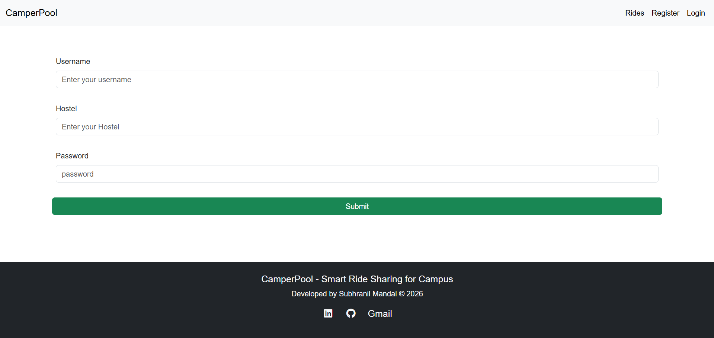
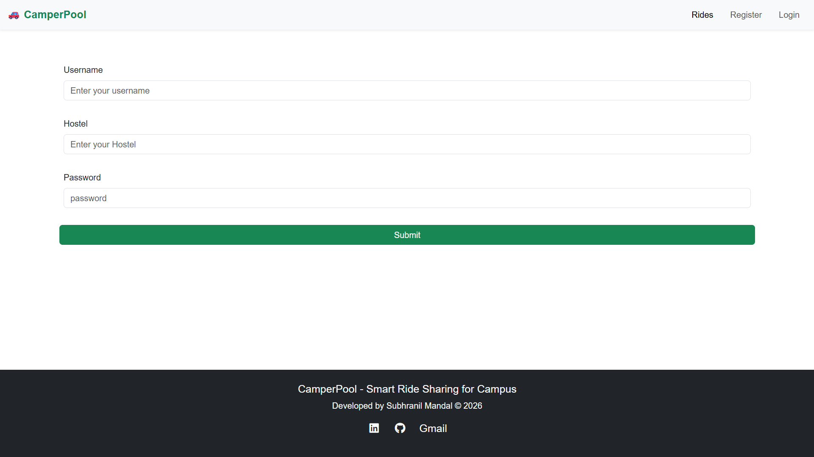
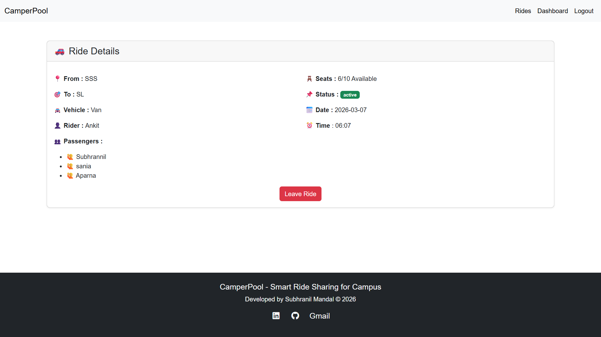
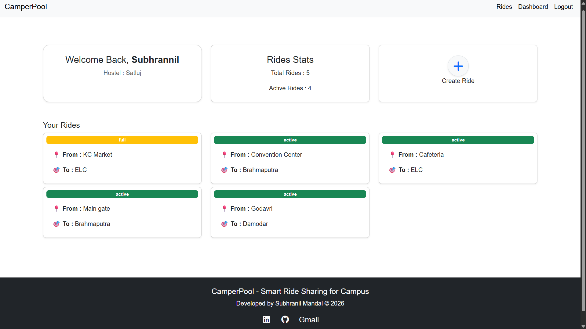
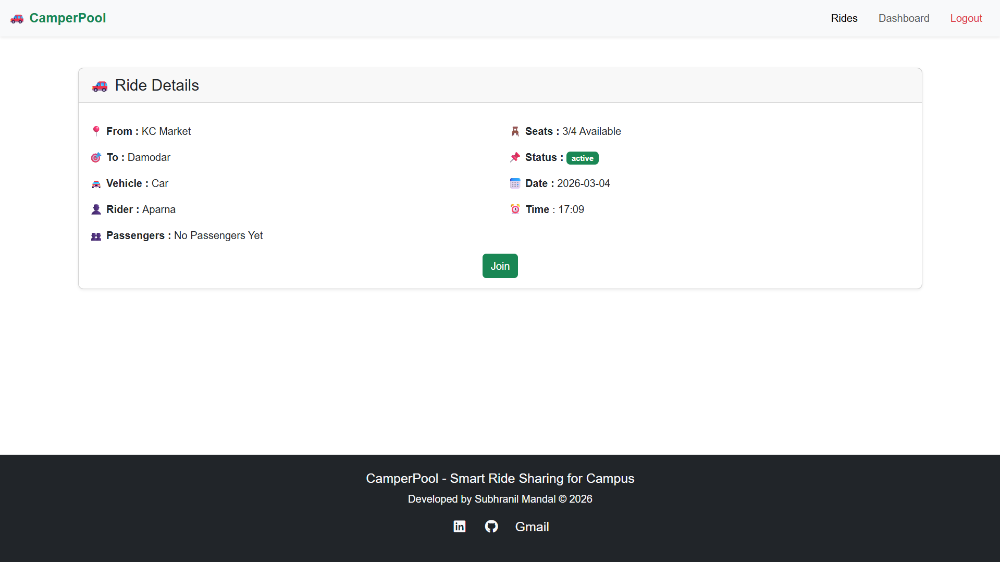
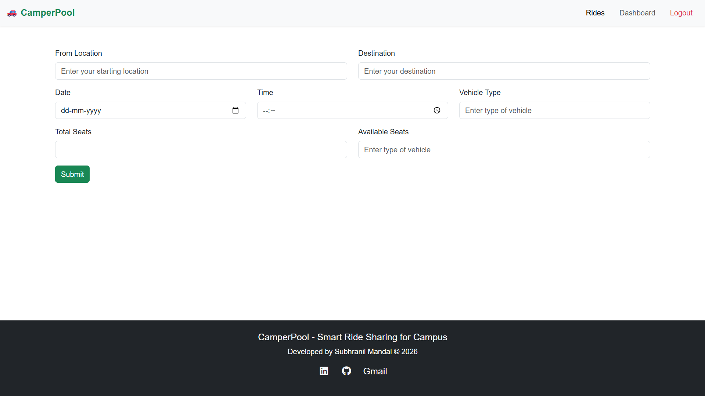
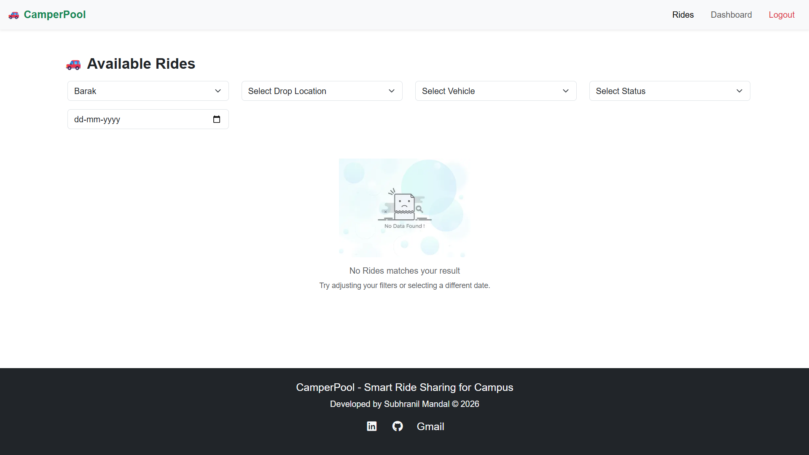

# 🚗 CamperPool

A Full-Stack Smart Ride Sharing Platform designed for campus transportation.
CamperPool allows students to create, join, and manage rides efficiently within their campus.


---

## 🔗 Live Demo

[](https://camperpool-production.up.railway.app)

---

## 🎥 Project Demonstration

[](https://youtu.be/-zx49D9SlG4) 

---

## 📌 Problem Statement

- In many colleges, hostels are located far from the main academic buildings.
Students travel individually every day, which increases transportation cost and fuel usage.
There is no proper communication system for students to coordinate rides with each other.
As a result, money is wasted and opportunities to build community connections are lost.

- CamperPool solves this problem by providing a platform where students can communicate and coordinate rides when traveling between hostel and college.
Students can share rides, reduce travel costs, and save fuel.
At the same time, it helps build a stronger student community through shared travel experiences.

---

## ✨ Features

- 🔐 User Authentication (Signup / Login / Logout)
- ➕ Create Ride
- 👥 Join Ride
- 🚪 Leave Ride
- ❌ Cancel Ride
- 📊 Dashboard with Total & Active Ride Count
- 🪑 Automatic Seat Availability Tracking
- 📅 Date & Time Based Ride Filtering
- 🛡️ Protected Routes (Only Logged-in Users Can Access Certain Features)
- 🌐 Deployed on Railway

---

## 🛠 Tech Stack

### Backend
- Node.js
- Express.js
- MongoDB Atlas
- Mongoose

### Frontend
- EJS (Embedded JavaScript Templates)
- Bootstrap 5

### Deployment
- Railway (Cloud Hosting)
- MongoDB Atlas (Database Hosting)

---

## 🗂️ Folder Structure Explanation

The project follows a modular MVC-based architecture to maintain scalability and readability:

- **models/**  
  Contains all database schemas (User and Ride models).

- **Routes/**  
  Contains all application routes like authentication and ride management.

- **Controller/**  
  Contains the business logic for handling requests and responses.

- **views/**  
  Contains all EJS template files used to render pages.

- **public/**  
  Contains static files like CSS.

- **utils/**  
  Contains helper utilities such as custom error handling and async wrappers.

- **config/**  
  Contains database configuration files.

```code
CamperPool/
│
├── config/
│ └── db.js # MongoDB connection setup
│
├── Controller/
│ ├── auth.js # Authentication logic
│ └── dashboard.js # Ride & dashboard logic
│
├── models/
│ ├── rideSchema.js # Ride schema
│ └── userSchema.js # User schema
│
├── Routes/
│ ├── auth.js # Authentication routes
│ └── dashboard.js # Ride & dashboard routes
│
├── public/
│ ├── css/
│  └── common.css # Global styles
│
├── utils/
│ ├── ExpressError.js # Custom error handler
│ └── wrapAsync.js # Async error wrapper
│
├── views/
│ ├── auth/
│ │   ├── login.ejs # login page 
│ │   └── register.ejs # Register page
│ │  
│ ├── dashboard/
│ │ ├── dashboard.ejs
│ │ ├── editRide.ejs
│ │ ├── newRide.ejs
│ │ ├── rides.ejs
│ │ └── showRide.ejs
│ │
│ ├── includes/
│ │ ├── flash.ejs
│ │ ├── footer.ejs
│ │ └── header.ejs
│ │
│ │── layouts/
│ │  │── boilerplate.ejs
│ └── error.ejs
|
│── assets/
|     │── screenshots
|
├── middlewares.js # Custom middleware
├── index.js # Entry point
├── schema.js # Validation schemas
├── package.json
├── .gitignore
├── README.md
└── .env (not committed)
```

## ⚙️ Installation (Run Locally)

1. Clone the repository:

```bash
git clone https://github.com/your-username/CamperPool.git
```
2. Navigate to project folder:

```bash
cd CamperPool
```

3. Install dependencies:

```bash
npm install
```

4. Create a .env file and add:

```code
MONGO_URL=your_mongodb_connection_string
SECRET=your_session_secret
``` 

5. Start the server:

```bash
npm start
```

6. Open in browser:

```code
http://localhost:3000
``` 
---

## 📷 Screenshots

### Login Page



### Register Page



### Available Rides



### 🏠 Dashboard



### 🚗 Ride Details Page



### ➕ Create Ride Form



### No Rides Found Page



---

## 🚀 Future Improvements

- Real-time notifications
- Google Maps integration
- In-app chat system
- Payment integration
- Ride rating system

---

## 👨‍💻 Author

- Subhranil Mandal
- First Year CSE Student
- JNU

---